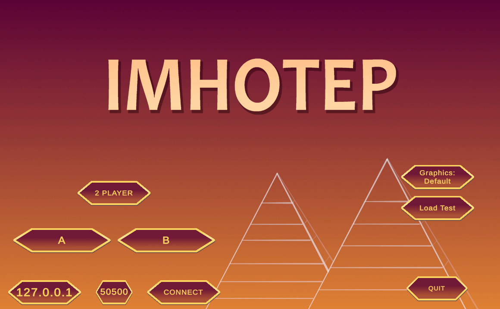
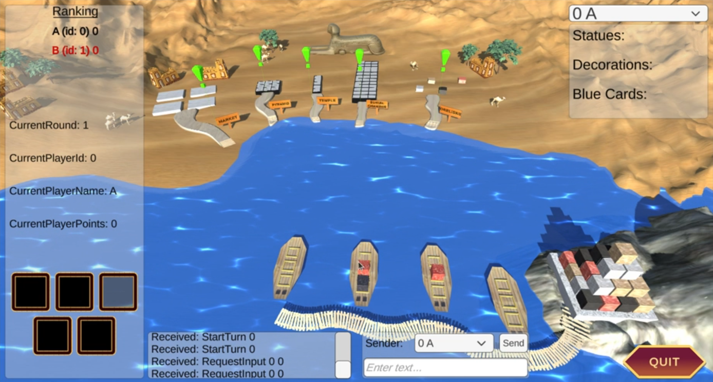

# 🏛️ Imhotep Game – C++ Networked Multiplayer Backend

This project implements the **backend logic** for the multiplayer strategy game *Imhotep*, developed in a group of 3 members. The game is themed around ancient Egyptian monument building and is played between a number of players. It features a given, separate graphical user interface (GUI) that interacts with this backend via a structured network protocol.

The backend was developed in modern C++ and is responsible for all core gameplay mechanics, including turn handling, rule enforcement, and scoring logic.

---

## 🌐 Network Integration

Real-time communication with the game server is handled using the `net::Client` framework. The backend strictly follows the defined network protocol to:

- Parse and interpret server messages
- Validate player actions and game states
- Respond with legal, context-aware commands
- Handle edge cases like invalid input and end-of-game state

This ensures a consistent and robust multiplayer experience, tightly synchronized with both the GUI and the central server.

---

## 🎮 Game Summary

- The game revolves around loading cards onto ships and sending them to various building sites:  
  Temple, Pyramid, Obelisk, Burial Chamber.
- Each site has unique placement rules and scoring mechanics.
- Players alternate turns, selecting cards and placing them strategically across the board.
- The GUI handles player interaction and rendering, while this backend enforces all game rules.

---

## 🧩 Technical Design

The project follows a modular object-oriented C++ design with the following components:

- `main.cpp` – Starts the client and handles network communication.
- `Game.cpp/hpp` – Manages global state, round transitions, and scoring.
- `Player.cpp/hpp` – Tracks each player's hand, placements, and scores.
- `Ship.cpp/hpp` – Manages card loading and docking logic.
- `MarketCard.cpp/hpp` – Represents cards with attributes like color and value.
- `MarketPlace.cpp/hpp` – Centralized card distribution logic.
- `ConstructionSite`, `Temple`, `Pyramid`, `Obelisk`, `BurialChamber` – Implement rules for each construction site.
- `checkValid.cpp/hpp` – Validates actions against game rules.
- `framework/` – Contains the provided `net::Client` networking module.

## 🗂️ Code Structure


---

## 🖼 Download the GUI
- **[Imhotep GUI for Windows](https://tc.tugraz.at/main/pluginfile.php/1616430/mod_folder/content/0/Imhotep_Windows.zip?forcedownload=1)**
- **[Imhotep GUI for Linux](https://tc.tugraz.at/main/pluginfile.php/1616430/mod_folder/content/0/Imhotep_Linux.zip?forcedownload=1)**


---

## ⚙️ How to Build and Run

Follow these steps to compile and run the client manually:

```bash
# Clone the repository
git clone <repo-url>
cd Imhotep-Game

# Create a build directory
mkdir build
cd build

# Generate build files using CMake
cmake ..

# Compile the project
cmake --build .

# Run the game client
./imhotep_server (player_count) (rounds_count)
example: ./imhotep 2 6

# Download the GUI, and make the program as executable
Linux: sudo chmod +x Imhotep.x86_64, then run it
Windows: start the program
```

## Start screen


## Gameplay

